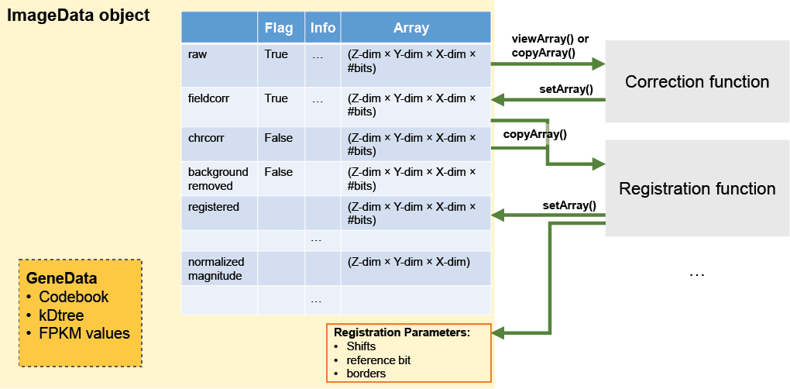

# ImageData object

This is designed to contain image arrays from all intermediate processing stages for troubleshooting and for collation of statistics across multiple FOVs (e.g. for global normalization). Also contains metadata such as image dimensions and registration parameters. Has methods to save data to an `imagedata.hdf5` file, and for retrieving and storing image arrays after each stage of processing.

## Standard processing order

Not all stages are used. Some are skippable or just placeholders. However, they are in order of processing i.e. an earlier stage must be performed before a later stage. When saving to `imagedata.hdf` file, not all stages need to be saved. You can specify the specifc stages to be saved, or not save any stages to save on file size and data transfer times. For global normalization, at least the **filtered** or **filtered_clipped** stage needs to be saved. When the word **"normalized"** is used, it refers to bit-wise normalization. There is a subsequent step to normalize pixel vectors to the unit vector. This is referred to as **"unitnormalized"**.

* **raw** original images
* **fieldcorr** field corrected images (field correction MUST precede distortion correction if both are being applied). *skippable*
* **chrcorr** chromatic distortion corrected images. *skippable*
* **backgroundremoved** background-removed images. *skippable*
* **registered** images registered across bits.
* **filtered** filtered images.
* **filtered_clipped"** same as filtered images, but negative values clipped to 0.
* **normalized** per-bit normalized images.
* **normalized_clipped** clipped per-bit normalized images (usually clipped to between 0 and 1). *skippable*
* **normalized_magnitude** Magnitude of per-bit normalized image. Has no bits dimension.
* **binarized** binarized image. *Placeholder, not used in code*
* **unitnormalized** images with all pixel-vectors normalized to unit vector. Used for vector distance comparison.
* **closestdistance** vector distances of every pixel to its closest codeword. Pixels far from any codeword are assigned `np.inf`. Has no bits dimension.
* **decoded** decoded image. Has no bits dimension.
* **decoded_sizefiltered** decoded with further region-size depenent filtering performed on spots.

